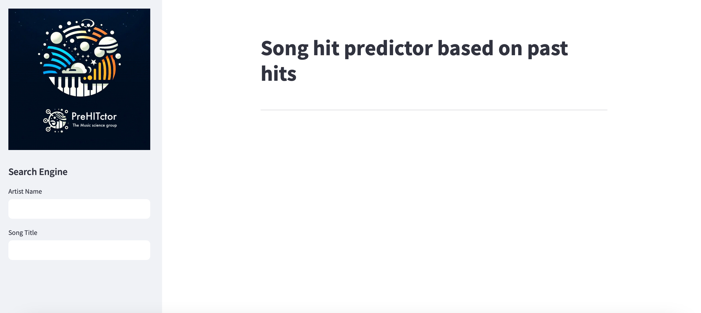
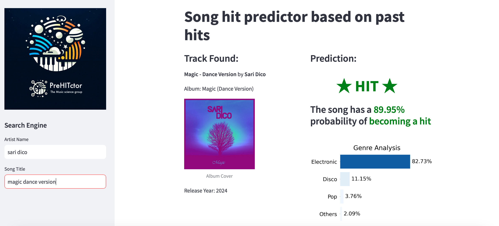

# Capstone Project: PreHITctor

This repository showcases the development of the capstone project "PreHITctor," which consists of two subprojects: the hit predictor and the genre classifier. Using "The Spotify Hit Predictor Dataset (1960-2019)," the probability of a song becoming a hit was predicted using various machine learning algorithms. Additionally, songs were classified into their root musical genres by building a Convolutional Neural Network for audio classification, utilizing Mel-Frequency Cepstral Coefficients (MFCCs) as features. For the genre classifier, a customized audio dataset was used, formed by merging the public GTZAN Dataset - Music Genre Classification and a private audio dataset.

The project is organized into three Jupyter notebooks and three Python files:

- 01_hit_predictor_EDA.ipynb and 02_hit_predictor_DE_ML.ipynb correspond to the hit predictor subproject. 

- 03_genre_classifier_model.ipynb, 04_hit_predictor_genre_classifier_app.py, genre_classification_data.py, and genre_classifier_functions.py correspond to the genre classifier subproject. 

You should run genre_classification_data.py only if you have the complete audio dataset in a folder called music_dataset and you want to generate the MFCCs file. I wanted to push this file to the repository, but it was too large. Send me a message, and I will provide it to you. Without this file, you cannot construct the genre classifier model (which is already included in the models folder anyway as genre_classifier.keras)

The performance of both subprojects is visualized through a web app contained in the 04_hit_predictor_genre_classifier_app.py file. You can run the app by typing streamlit run 04_hit_predictor_genre_classifier_app.py in the terminal. This command opens the web app, as shown in the following image, where you can input the artist and song to be predicted and classified.



After entering the artist and the song (and pressing Enter), the results of the hit predictor and genre classifier are displayed, as illustrated below (example: artist - Sari Dico, song - Magic Dance Version):



## Considerations and limitations:

- To predict whether a song will be a hit or flop, the song must be on Spotify.
- To classify the genre of a song, the song must be on YouTube.
- The project is designed primarily for new artists with already produced songs within mainstream and/or non-avant-garde genres. You need to add your Spotify CLIENT_ID and CLIENT_SECRET in an .env file (which should be placed in the root directory of the project). If you are an artist with a song on Spotify, check your success possibilities with the app!.


## Set up your Environment

Please make sure you have forked the repo and set up a new virtual environment. For this purpose you can use the following commands:

The added [requirements file](requirements.txt) contains all libraries and dependencies we need to execute the hands-on ml notebooks.

### **`macOS`** type the following commands : 


- Install the virtual environment and the required packages by following commands:

    ```BASH
    pyenv local 3.11.3
    python -m venv .venv
    source .venv/bin/activate
    pip install --upgrade pip
    pip install -r requirements.txt
    ```
### **`WindowsOS`** type the following commands :

- Install the virtual environment and the required packages by following commands.

   For `PowerShell` CLI :

    ```PowerShell
    pyenv local 3.11.3
    python -m venv .venv
    .venv\Scripts\Activate.ps1
    pip install --upgrade pip
    pip install -r requirements.txt
    ```

    For `Git-bash` CLI :
  
    ```BASH
    pyenv local 3.11.3
    python -m venv .venv
    source .venv/Scripts/activate
    pip install --upgrade pip
    pip install -r requirements.txt
    ```
     **`Note:`**
    If you encounter an error when trying to run `pip install --upgrade pip`, try using the following command:

    ```Bash
    python.exe -m pip install --upgrade pip
    ```
    
The data (The Spotify Hit Predictor Dataset (1960-2019)) used in this notebook for the hit predictor subproject is saved in a `.zip` file as `data.zip`. To unzip it, copy the block below into your terminal:

```Bash
unzip data.zip
```

For the genre classifier, if you are interested in obtaining the audio dataset, you can download the GTZAN Dataset - Music Genre Classification from 
[this link](https://www.kaggle.com/datasets/andradaolteanu/gtzan-dataset-music-genre-classification). For the private audio dataset, send me a message, and I will provide it to you.